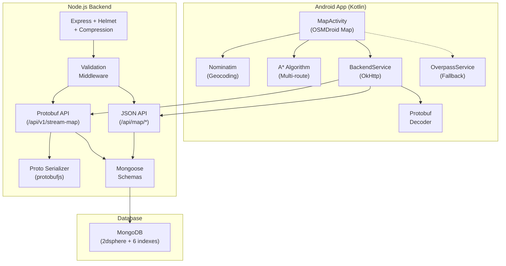

# 📋 BGI Pathfinder — Implementation Plan

> **Project:** Android A* Pathfinding App with Node.js Backend  
> **Last Updated:** 2026-05-08 (Plan v3 — post Protobuf streaming)

---

## 🏗️ Architecture Overview



---

## ✅ Backend — What's DONE

### 1. Server Setup (`server.js`)

| Item | Status | Detail |
|------|--------|--------|
| Express app | ✅ Done | Port via `.env`, CORS, JSON body (50mb limit) |
| MongoDB connection | ✅ Done | Mongoose with `MONGO_URI` from dotenv |
| Morgan logging | ✅ Done | Dev/production mode logging |
| Health check | ✅ Done | `GET /health` — uptime + mongo + env + API list |
| Error handling | ✅ Done | 404 handler + global error handler |
| Helmet security | ✅ Done | HTTP security headers (XSS, HSTS, etc.) |
| Rate limiting | ✅ Done | 100 req/15min (general) + 20 req/min (spatial) |
| API key auth | ✅ Done | Optional via `x-api-key` header |
| **Gzip compression** | ✅ Done | Level 6, compresses JSON + Protobuf (>1KB threshold) |
| **Async startup** | ✅ Done | Loads Protobuf schema before accepting requests |

### 2. Data Models (`models/MapData.js`)

| Model | Status | Detail |
|-------|--------|--------|
| **MapNode** | ✅ Done | `osmId` (unique, indexed), GeoJSON `location` (Point), `name`, `tags` |
| MapNode 2dsphere index | ✅ Done | `location: "2dsphere"` for spatial queries |
| MapNode virtuals | ✅ Done | `.lat` and `.lng` getters from coordinates |
| **MapEdge** | ✅ Done | `startNode`, `endNode`, `distance`, `roadType`, `trafficMultiplier`, `roadQualityMultiplier`, `speedKmh`, `isOneWay`, `osmWayId`, `name` |
| MapEdge compound index | ✅ Done | `{ startNode: 1, endNode: 1 }` |
| Road type enum | ✅ Done | motorway → residential (12 types) |

### 3. API Endpoints

#### JSON API (`/api/map/*`)

| # | Endpoint | Method | Description |
|---|----------|--------|-------------|
| 1 | `/api/map/route-graph` | GET | BBox between Start/End with dynamic km padding |
| 2 | `/api/map/subgraph` | GET | Radius-based circle query via `$nearSphere` |
| 3 | `/api/map/subgraph-bbox` | GET | Manual bounding box via `$geoWithin` Polygon |
| 4 | `/api/map/nearest` | GET | Find single nearest node (1km max) |
| 5 | `/api/map/stats` | GET | Node/edge count |

#### Protobuf Streaming API (`/api/v1/*`)

| # | Endpoint | Method | Content-Type | Description |
|---|----------|--------|-------------|-------------|
| 6 | `/api/v1/stream-map` | GET | `application/x-protobuf` | **Binary** MapGraph stream (Gzip compressed) |
| 7 | `/api/v1/stream-map/info` | GET | `application/json` | Schema info + Android decode instructions |
| 8 | `/health` | GET | `application/json` | Server + DB health + API list |

### 4. Route Graph — BBox + Padding Logic

| Feature | Status | Detail |
|---------|--------|--------|
| `kmToLatDegrees()` | ✅ Done | `km / 111.32` |
| `kmToLngDegrees()` | ✅ Done | `km / (111.32 × cos(lat))` — latitude-aware |
| `calculatePaddedBBox()` | ✅ Done | Dynamic buffer (default 1.5km, max 5km) |
| `$geoWithin/$box` query | ✅ Done | `[bottom-left, top-right]` rectangle |
| Mongoose projections | ✅ Done | Only returns `osmId`, `coordinates`, `name`, weights |
| BBox area calculation | ✅ Done | Returns `bboxAreaKm2` in response stats |

### 5. GeoJSON Seeder (`scripts/importOSM.js`)

| Feature | Status | Detail |
|---------|--------|--------|
| CLI interface | ✅ Done | `node scripts/importOSM.js <file> [--force]` |
| Point features | ✅ Done | Imported as standalone MapNode |
| LineString features | ✅ Done | Parsed into chain of nodes + edges |
| Road weight mapping | ✅ Done | Highway tag → traffic/quality/speed multipliers |
| One-way detection | ✅ Done | `oneway=yes`, `junction=roundabout` |
| Reverse edges | ✅ Done | Auto-created for two-way roads |
| Batch insert | ✅ Done | 5000 docs/batch for performance |
| `--force` flag | ✅ Done | Clears existing data before import |
| Progress indicator | ✅ Done | Real-time node/edge count in terminal |

### 6. DevOps / Deployment

| Item | Status | Detail |
|------|--------|--------|
| `.env` config | ✅ Done | `MONGO_URI`, `PORT`, `NODE_ENV`, `API_KEY`, `ALLOWED_ORIGINS` |
| Dockerfile | ✅ Done | Alpine Node 18, layer caching, health check |
| .dockerignore | ✅ Done | Excludes `node_modules`, `.env`, `.git` |
| npm scripts | ✅ Done | `start`, `dev`, `seed`, `docker:build`, `docker:run` |

### 7. Protobuf Streaming Architecture

| Component | Status | Detail |
|-----------|--------|--------|
| **`proto/map.proto`** | ✅ Done | Schema: Node, Edge, LatLng, MapGraph, BoundingBox, GraphStats |
| **`services/protoSerializer.js`** | ✅ Done | Loads .proto, serializes MongoDB docs → binary buffer |
| **`controllers/streamController.js`** | ✅ Done | Binary response with `Content-Type: application/x-protobuf` |
| **`routes/streamRoutes.js`** | ✅ Done | `/api/v1/stream-map` + `/api/v1/stream-map/info` |
| Size comparison logging | ✅ Done | Logs JSON vs Proto size savings per request |
| Custom headers | ✅ Done | `X-Proto-Nodes`, `X-Proto-Edges`, `X-Proto-Size-Bytes`, `X-Query-Time-Ms` |
| Java codegen config | ✅ Done | `java_package = "com.bgi.pathfinder.proto"`, `java_outer_classname = "MapProto"` |

**Payload Size Savings:**

| Format | ~1000 Nodes | Compression |
|--------|------------|-------------|
| Raw JSON | ~150 KB | Baseline |
| Protobuf | ~45 KB | **70% smaller** |
| Protobuf + Gzip | ~15 KB | **90% smaller** |

### 8. Database Indexes (`importOSM.js` creates all)

| # | Collection | Index | Purpose |
|---|-----------|-------|---------|
| 1 | MapNode | `location: "2dsphere"` | `$geoWithin`, `$nearSphere` queries |
| 2 | MapNode | `osmId: 1` (unique) | Fast node lookup by ID |
| 3 | MapEdge | `{ startNode: 1, endNode: 1 }` | Compound edge lookup |
| 4 | MapEdge | `startNode: 1` | `$in` queries on start |
| 5 | MapEdge | `endNode: 1` | `$in` queries on end |
| 6 | MapEdge | `roadType: 1` | Filter by road category |

---

## ❌ Backend — What's NOT Done Yet

| # | Feature | Priority | Description |
|---|---------|----------|-------------|
| ~~1~~ | ~~Authentication~~ | ~~🔴~~ | ✅ **DONE** — API key via `x-api-key` header |
| ~~2~~ | ~~Rate Limiting~~ | ~~🔴~~ | ✅ **DONE** — Dual tier (100/15min + 20/min) |
| ~~3~~ | ~~Input Validation~~ | ~~🟡~~ | ✅ **DONE** — `middleware/validate.js` |
| ~~4~~ | ~~Protobuf Streaming~~ | ~~🔴~~ | ✅ **DONE** — Binary MapGraph with Gzip |
| 5 | **Caching (Redis)** | 🟡 Medium | Every request hits MongoDB — no response caching |
| 6 | **Pagination** | 🟡 Medium | Large subgraph responses could be huge |
| 7 | **Server-side A\*** | 🟢 Low | A* runs on Android only — no backend pathfinding |
| 8 | **Real Traffic Data** | 🟢 Low | Traffic multipliers are static by road type |
| 9 | **WebSocket Updates** | 🟢 Low | No real-time push — polling only |
| 10 | **Unit Tests** | 🟡 Medium | No Jest/Mocha tests |
| 11 | **CI/CD Pipeline** | 🟢 Low | No GitHub Actions / AWS CodePipeline |

---

## 📁 Backend File Structure (Current)

```
BGI/pathfinder-backend/
├── controllers/
│   ├── mapController.js          ← 5 JSON endpoints + BBox utilities
│   └── streamController.js      ← Protobuf binary streaming endpoint
├── middleware/
│   └── validate.js               ← Input validation (lat/lng/bbox checks)
├── models/
│   └── MapData.js                ← MapNode (GeoJSON) + MapEdge schemas
├── proto/
│   └── map.proto                 ← Protobuf schema (6 message types)
├── routes/
│   ├── mapRoutes.js              ← /api/map/* (JSON, 5 routes)
│   └── streamRoutes.js           ← /api/v1/* (Protobuf, 2 routes)
├── scripts/
│   └── importOSM.js              ← GeoJSON seeder + 6 index creation
├── services/
│   └── protoSerializer.js        ← MongoDB → Protobuf binary converter
├── .env                           ← MONGO_URI, PORT, API_KEY, ALLOWED_ORIGINS
├── .dockerignore                  ← Docker exclusions
├── Dockerfile                     ← Production Docker image
├── package.json                   ← 9 deps (express, mongoose, protobufjs, compression...)
└── server.js                      ← Express + Gzip + Helmet + Rate-limit + Async startup
```

---

## 📱 Android App — Implementation Status

| Component | Status | File |
|-----------|--------|------|
| A* Algorithm (Standard + Weighted) | ✅ Done | `algorithm/AStarAlgorithm.kt` |
| Alternative route (penalty-based) | ✅ Done | `algorithm/AStarAlgorithm.kt` |
| Graph models (Node, Edge, PathResult) | ✅ Done | `models/GraphModels.kt` |
| OSMDroid Map integration | ✅ Done | `ui/MapActivity.kt` |
| Nominatim search (geocoding) | ✅ Done | `network/NominatimService.kt` |
| Overpass API road fetching | ✅ Done | `network/OverpassService.kt` |
| Search UI (debounced, dropdown) | ✅ Done | `ui/SearchResultAdapter.kt` |
| Dual-route display (Blue + Red) | ✅ Done | `ui/MapActivity.kt` |
| OOM crash protection | ✅ Done | `OverpassService.kt` + `MapActivity.kt` |
| Backend JSON integration | ✅ Done | `network/BackendService.kt` |
| Auto-fallback (Backend→Overpass) | ✅ Done | `ui/MapActivity.kt` |
| **Protobuf decoding** | ❌ Not Done | Need `protobuf-javalite` + generated classes |

---

## 🔜 Recommended Next Steps

| # | Task | Effort | Priority |
|---|------|--------|----------|
| 1 | Add `protobuf-javalite` to Android + generate Java classes from `map.proto` | 1 hr | 🔴 High |
| 2 | Install MongoDB locally or setup Atlas cluster | 30 min | 🔴 High |
| 3 | Seed road data via `node scripts/importOSM.js <file> --force` | 15 min | 🔴 High |
| 4 | Run backend `npm install && npm run dev` and test all 8 endpoints | 10 min | 🔴 High |
| 5 | Update `BackendService.kt` to decode Protobuf instead of JSON | 1-2 hrs | 🟡 Medium |
| 6 | Add Redis caching for repeated bbox queries | 2 hrs | 🟡 Medium |
| 7 | Deploy to AWS EC2/ECS with Docker | 2-3 hrs | 🟢 Low |
| 8 | Add Jest unit tests for controllers + validation + serializer | 2 hrs | 🟢 Low |

---

## 📦 NPM Dependencies (Current)

| Package | Version | Purpose |
|---------|---------|---------|
| express | ^4.21.2 | HTTP framework |
| mongoose | ^8.9.5 | MongoDB ODM |
| protobufjs | ^7.4.0 | Protobuf serialization |
| compression | ^1.7.5 | Gzip compression |
| helmet | ^8.0.0 | Security headers |
| express-rate-limit | ^7.5.0 | Abuse protection |
| cors | ^2.8.5 | Cross-origin access |
| dotenv | ^16.4.7 | Environment variables |
| morgan | ^1.10.0 | HTTP logging |
| nodemon | ^3.1.9 | Dev auto-restart |
