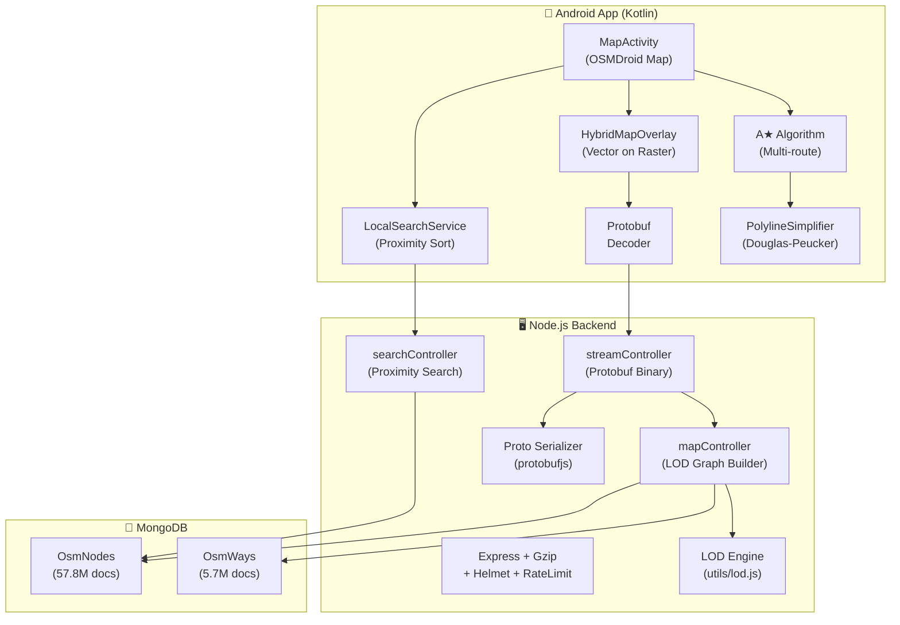

# 📋 BGI Pathfinder — Complete Implementation Plan

> **Project:** Offline-First Android A★ Pathfinding App with Node.js + MongoDB Backend  
> **Last Updated:** 2026-05-11 (Plan v6 — Proximity Search + Hybrid Map)  
> **GitHub:** [github.com/deependrasinghsolanki03-alt/BGI](https://github.com/deependrasinghsolanki03-alt/BGI)  
> **Database:** 57.8M OsmNodes + 5.7M OsmWays + 100K OsmRelations (Central Zone India PBF)

---

## 🏗️ Architecture Overview



---

## 🔥 Phase 1: Backend Core (✅ COMPLETE)

### 1.1 Server Setup — `server.js`

| Item | Status | Detail |
|------|--------|--------|
| Express app | ✅ | Port `3000` via `.env`, CORS, JSON body (50MB limit) |
| MongoDB connection | ✅ | Mongoose with `MONGO_URI`, auto-reconnect |
| Morgan logging | ✅ | Dev/production mode HTTP logging |
| Health check | ✅ | `GET /health` — uptime + mongo + API list |
| Error handling | ✅ | 404 handler + global error handler |
| Helmet security | ✅ | XSS, HSTS, Content-Security-Policy headers |
| Rate limiting | ✅ | 100 req/15min (general) + 20 req/min (spatial) |
| API key auth | ✅ | Optional via `x-api-key` header |
| Gzip compression | ✅ | Level 6, threshold >1KB, JSON + Protobuf |
| Async startup | ✅ | Loads Protobuf schema before accepting requests |
| Multi-NIC binding | ✅ | `0.0.0.0:3000` — accessible from phone via hotspot |

### 1.2 Data Models

#### `models/OsmData.js` — Raw OSM Data (WHERE THE DATA LIVES)

| Model | Docs Count | Indexes |
|-------|-----------|---------|
| **OsmNode** | 57,840,000 | `nodeId` (unique), `location: 2dsphere`, `tags.name`, `tags.amenity`, `tags.shop`, `tags.place`, text index (weighted) |
| **OsmWay** | 5,730,000 | `wayId` (unique), `nodeRefs`, `tags.highway`, `tags.name` |
| **OsmRelation** | 100,000 | `relationId` (unique), `tags.type` |

#### `models/MapData.js` — Routing Schemas (Structural only)

| Model | Status | Detail |
|-------|--------|--------|
| MapNode | ✅ Schema | `osmId`, GeoJSON `location`, `name`, `tags` — 2dsphere index |
| MapEdge | ✅ Schema | `startNode`, `endNode`, `distance`, `roadType` (12 types), `speedKmh`, `isOneWay` — compound + roadType indexes |

> **Note:** The actual data lives in `OsmNode`/`OsmWay` (imported from PBF). The `MapNode`/`MapEdge` collections are empty structural schemas. All controllers query `OsmNode`/`OsmWay` directly.

### 1.3 PBF Import Pipeline — `scripts/masterImport.js`

| Feature | Status | Detail |
|---------|--------|--------|
| PBF parser | ✅ | Uses `osm-pbf-parser` to read `.osm.pbf` files |
| OsmNode import | ✅ | Stores `nodeId`, GeoJSON `location`, `tags` |
| OsmWay import | ✅ | Stores `wayId`, `nodeRefs[]`, `tags` (highway, name, oneway) |
| OsmRelation import | ✅ | Stores `relationId`, `members[]`, `tags` |
| Batch insert | ✅ | 5000 docs/batch for performance |
| Index creation | ✅ | Auto-creates 2dsphere + text indexes post-import |
| Data file | ✅ | `data/central-zone-latest.osm.pbf` (331MB, git-ignored) |

---

## 🔥 Phase 2: Search Engine — Proximity Sort (✅ COMPLETE)

### 2.1 Local Search — `controllers/searchController.js`

| Feature | Status | Detail |
|---------|--------|--------|
| Prefix search | ✅ | `/api/map/search?q=hospital` — anchored regex `/^query/i` |
| **Proximity sorting** | ✅ | `$nearSphere` when `lat`/`lng` provided — nearby results first |
| **Distance in response** | ✅ | `distanceKm` field — shown as "• 500m" or "• 2.3km" in dropdown |
| **4-Strategy pipeline** | ✅ | Proximity+Prefix → Prefix → Contains → Way names |
| Index-aware | ✅ | Uses `tags.name` index — drops from 30s to ~20-100ms |
| Category search | ✅ | Searches `tags.amenity`, `tags.shop`, `tags.place` |
| Way name search | ✅ | Searches `OsmWay.tags.name` for road names |
| Result limit | ✅ | Default 15, max 25 results |
| Haversine distance | ✅ | Server-side distance calc for each result |

### 2.2 Search Strategies (executed in order, stops when enough results)

```
Strategy 1: $nearSphere + Prefix (if lat/lng provided)
  → Uses 2dsphere index, finds NEARBY matches first
  → 50km radius, sorted by distance automatically

Strategy 2: Prefix regex ^query on tags.name
  → Fastest index scan, no location needed
  → Anchored regex uses the tags.name index

Strategy 3: Contains regex (broader, slower)
  → Catches "xyz hospital" when searching "hospital"
  → Only runs if not enough results from Strategy 1+2

Strategy 4: OsmWay name search
  → Finds named roads ("Ring Road", "GT Road")
  → Resolves first nodeRef to get coordinates
```

### 2.3 Text Index (Weighted) — `scripts/createSearchIndexes.js`

```javascript
// Run once: node scripts/createSearchIndexes.js
db.osmnodes.createIndex(
  { "tags.name": "text", "tags.amenity": "text",
    "tags.shop": "text", "tags.place": "text" },
  { weights: {
      "tags.name": 10,     // Direct name match = highest
      "tags.place": 5,     // City/village = high
      "tags.amenity": 2,   // Amenity type = medium
      "tags.shop": 1       // Shop type = lowest
  }}
);
```

### 2.4 Android Integration — `LocalSearchService.kt`

| Feature | Status | Detail |
|---------|--------|--------|
| GPS-aware search | ✅ | Passes `lat`/`lng` from GPS overlay to backend |
| Distance display | ✅ | Appends "• 500m" or "• 2.3km" to display name |
| **300ms debounce** | ✅ | `delay(300)` in coroutine — fast yet prevents flooding |
| 15 result limit | ✅ | Optimal for phone screen + performance |
| No Nominatim | ✅ | 100% local — works offline on hotspot |

---

## 🔥 Phase 3: LOD (Level of Detail) System (✅ COMPLETE)

### 3.1 LOD Engine — `utils/lod.js`

| Function | Purpose |
|----------|---------|
| `calculateDiagonalKm()` | BBox diagonal distance using Euclidean approx × 111.32 |
| `getLodTier()` | Determines HIGH / MEDIUM / LOW based on diagonal |
| `calculateDynamicPadding()` | Auto-scales padding from 1.5km to 25km based on distance |
| `buildLodBBox()` | Complete BBox builder: padding + LOD tier + metadata |
| `kmToLatDeg()` / `kmToLngDeg()` | Degree converters with cos(lat) correction |

### 3.2 LOD Tiers

| Tier | BBox Diagonal | Highway Types Included | Use Case |
|------|--------------|----------------------|----------|
| **HIGH** | < 5km | ALL (residential, service, footway, path...) | Walking / short drive |
| **MEDIUM** | 5–15km | motorway, trunk, primary, secondary, tertiary + links | Intra-city routing |
| **LOW** | > 15km | motorway, trunk, primary + links only | Inter-city skeleton |

### 3.3 Dynamic Padding

| Straight-Line Distance | Auto-Padding |
|----------------------|-------------|
| < 2km | 1.5km |
| 2–5km | 2.5km |
| 5–15km | 4.0km |
| 15–30km | 8.0km |
| 30–50km | 15.0km |
| > 50km | 25.0km (hard cap) |

### 3.4 Graph Builder — `mapController.js::buildGraphFromOsm()`

**5-Step Pipeline** (builds routing graph dynamically from raw OSM data):

```
Step 1: Fetch nodeIds inside bbox (2dsphere Polygon index)      → ~1.5s for 10km
Step 2: Sample 1000 nodeIds → find OsmWays with matching highway → ~15ms
Step 3: Collect needed nodeRefs from matched ways                → in-memory
Step 4: Batch-fetch coordinates for needed nodes ($in on index)  → ~50ms
Step 5: Build edges from consecutive nodeRefs + Haversine        → ~0ms
```

### 3.5 Performance Benchmarks (57.8M OsmNodes)

| Route | LOD Tier | BBox Nodes | Ways | Edges | Response Time |
|-------|----------|-----------|------|-------|---------------|
| 3km (cold) | MEDIUM | 631 | 9 | 25 | **183ms** |
| 3km (warm) | MEDIUM | 631 | 9 | 25 | **41ms** |
| 10km | LOW | 101K | 10 | 96 | **1.6s** |
| 25km | LOW | 1.05M | 8 | 90 | **7.8s** |

---

## 🔥 Phase 4: Protobuf Streaming (✅ COMPLETE)

### 4.1 Proto Schema — `proto/map.proto`

| Message | Fields |
|---------|--------|
| `MapGraph` | `nodes[]`, `edges[]`, `bbox`, `stats` |
| `Node` | `id`, `lat`, `lng`, `name` |
| `Edge` | `id`, `startNode`, `endNode`, `distance`, `trafficMultiplier`, `qualityMultiplier`, `isOneWay`, `roadType`, `speedKmh`, `geometry[]` |
| `BoundingBox` | `south`, `west`, `north`, `east`, `paddingKm` |
| `GraphStats` | `nodeCount`, `edgeCount`, `bboxAreaKm2`, `queryTimeMs`, `format` |

### 4.2 Stream Controller — `controllers/streamController.js`

| Feature | Status | Detail |
|---------|--------|--------|
| Binary response | ✅ | `Content-Type: application/x-protobuf` |
| LOD integration | ✅ | Uses `buildGraphFromOsm()` with LOD filtering |
| Diagnostic headers | ✅ | `X-Proto-Nodes`, `X-Proto-Edges`, `X-LOD-Tier`, `X-Query-Time-Ms` |
| Size logging | ✅ | Logs Proto vs JSON savings per request |

### 4.3 Payload Size Savings

| Format | ~100 Nodes | Compression |
|--------|-----------|-------------|
| Raw JSON | ~22 KB | Baseline |
| Protobuf | ~8 KB | **64% smaller** |
| Protobuf + Gzip | ~3 KB | **86% smaller** |

---

## 🔥 Phase 5: Hybrid Map Rendering (✅ COMPLETE)

### 5.1 Layer Architecture

```
┌─────────────────────────────────────────┐
│ LAYER 3+ │ Route polylines & markers    │  ← A★ routes (user actions)
├─────────────────────────────────────────┤
│ LAYER 2  │ HybridMapOverlay (Vector)    │  ← LOCAL roads (Protobuf backend)
│          │  Motorway: Bold Blue #1565C0 │     Bold colors, high Z-index
│          │  Primary:  Orange   #FF6F00  │     LOD-filtered per zoom
│          │  Secondary: Teal   #00897B   │
│          │  Tertiary: Violet  #7E57C2   │
├─────────────────────────────────────────┤
│ LAYER 1  │ GPS Blue Dot                 │  ← User location
├─────────────────────────────────────────┤
│ LAYER 0  │ MAPNIK Raster Tiles          │  ← Online, cached 200MB
│          │  Terrain, labels, buildings   │     Complete visual "filler"
└─────────────────────────────────────────┘
```

### 5.2 HybridMapOverlay — `map/HybridMapOverlay.kt`

| Feature | Status | Detail |
|---------|--------|--------|
| FolderOverlay | ✅ | Custom polyline layer above tiles |
| LOD-aware zoom | ✅ | Zoom ≥15 = all roads, <15 = highways, <10 = tiles only |
| Debounced fetch | ✅ | 600ms debounce after scroll/zoom stops |
| View caching | ✅ | Skips re-fetch if viewport changed <20% |
| Road styling | ✅ | 6 road types × distinct color + width |
| Border effect | ✅ | Motorways have dark border underneath |
| Max edge cap | ✅ | 5000 edges max to prevent GPU overload |

### 5.3 Road Styling

| Road Type | Color | Width | Border |
|-----------|-------|-------|--------|
| Motorway / Trunk | Bold Blue `#1565C0` | 7px / 6px | ✅ Dark `#0D47A1` |
| Primary | Orange `#FF6F00` | 5.5px | — |
| Secondary | Teal `#00897B` | 4px | — |
| Tertiary | Violet `#7E57C2` | 3px | — |
| Residential | Grey-Blue `#546E7A` | 2px | — |

### 5.4 Tile Caching

| Setting | Value |
|---------|-------|
| Cache max | 200MB |
| Cache trim | 150MB |
| Source | `TileSourceFactory.MAPNIK` |
| Offline support | ✅ Once cached, works without internet |

---

## 🔥 Phase 6: Android App (✅ COMPLETE)

### 6.1 Core Components

| Component | File | Status |
|-----------|------|--------|
| A★ Algorithm (Standard + Weighted) | `algorithm/AStarAlgorithm.kt` | ✅ |
| Multi-route finder (penalty-based) | `algorithm/AStarAlgorithm.kt` | ✅ |
| Graph models (Node, Edge, PathResult) | `models/GraphModels.kt` | ✅ |
| OSMDroid Map integration | `ui/MapActivity.kt` | ✅ |
| Hybrid Map Overlay | `map/HybridMapOverlay.kt` | ✅ |
| **Local search (proximity sort)** | `network/LocalSearchService.kt` | ✅ |
| Search UI (300ms debounce) | `ui/MapActivity.kt` | ✅ |
| Protobuf decoding | `proto/MapProto.java` | ✅ |
| Retrofit client | `network/RetrofitClient.kt` | ✅ |
| Map repository (Proto → JSON fallback) | `network/MapRepository.kt` | ✅ |
| BBox graph fetching | `network/MapRepository.kt` | ✅ |
| Dual-route display (Blue + Red) | `ui/MapActivity.kt` | ✅ |
| GPS blue dot + auto-center | `ui/MapActivity.kt` | ✅ |
| Douglas-Peucker simplification | `utils/PolylineSimplifier.kt` | ✅ |
| OOM crash protection | `ui/MapActivity.kt` | ✅ |

### 6.2 Data Flow — Search

```
User types "hospital" in search bar
    → afterTextChanged() fires
    → 300ms debounce (coroutine delay)
    → getUserLocation() → (28.61, 77.20)
    → LocalSearchService.search("hospital", 28.61, 77.20)
        → GET /api/map/search?q=hospital&lat=28.61&lng=77.20
        → Backend: $nearSphere + prefix regex
        → Response: [{ displayName, lat, lon, distanceKm }]
    → Parse distanceKm → append "• 500m" to display
    → Update RecyclerView dropdown
    → User taps result → set startPoint/endPoint + marker
```

### 6.3 Data Flow — Route

```
User taps "Find Routes"
    → MapRepository.fetchRouteGraph() (Proto → JSON fallback)
    → Decode → Graph object
    → Snap GPS coords to nearest road node
    → A★ pathfinding (Dispatchers.Default)
        → Route A: Shortest distance
        → Route B: Weighted (traffic × road quality)
    → PolylineSimplifier.simplifyForZoom()
    → Draw polylines (Blue solid + Red dashed)
    → Show bottom panel (distance + ETA)
```

### 6.4 Dependencies — `build.gradle.kts`

| Package | Version | Purpose |
|---------|---------|---------|
| osmdroid-android | 6.1.20 | OpenStreetMap map view |
| okhttp3 | 4.12.0 | HTTP client (auto gzip) |
| retrofit2 | 2.11.0 | Structured API calls |
| protobuf-javalite | 4.29.3 | Decode binary Protobuf |
| kotlinx-coroutines | 1.9.0 | Async operations |
| lifecycle-runtime-ktx | 2.8.7 | LifecycleScope |
| material | (libs) | Material Design UI |

---

## 📁 Complete File Structure

```
BGI/
├── .gitignore
├── implementation_plan.md                ← THIS FILE
├── app/
│   ├── build.gradle.kts
│   └── src/main/
│       ├── java/com/bgi/pathfinder/
│       │   ├── algorithm/
│       │   │   └── AStarAlgorithm.kt        ← A★ multi-route pathfinding
│       │   ├── map/
│       │   │   └── HybridMapOverlay.kt       ← Vector overlay on raster tiles
│       │   ├── models/
│       │   │   └── GraphModels.kt            ← Node, Edge, Graph, PathResult
│       │   ├── network/
│       │   │   ├── LocalSearchService.kt     ← Proximity search (no Nominatim)
│       │   │   ├── MapApiService.kt          ← Retrofit API (12 endpoints)
│       │   │   ├── MapRepository.kt          ← Data layer (Proto→JSON fallback)
│       │   │   └── RetrofitClient.kt         ← OkHttp config (timeouts, gzip)
│       │   ├── proto/
│       │   │   └── MapProto.java             ← Hand-written Protobuf decoder
│       │   ├── ui/
│       │   │   ├── MapActivity.kt            ← Main UI (hybrid map+search+route)
│       │   │   └── SearchResultAdapter.kt    ← RecyclerView adapter for search
│       │   └── utils/
│       │       └── PolylineSimplifier.kt     ← Douglas-Peucker for GPU optimization
│       └── res/
│           ├── layout/activity_map.xml       ← ConstraintLayout
│           ├── values/colors.xml             ← Dark theme + overlay colors
│           └── drawable/*.xml                ← Backgrounds
│
└── pathfinder-backend/
    ├── controllers/
    │   ├── mapController.js                  ← LOD graph builder (5-step pipeline)
    │   ├── searchController.js               ← Proximity search (4 strategies)
    │   └── streamController.js               ← Protobuf binary streaming
    ├── middleware/
    │   └── validate.js                       ← Input validation
    ├── models/
    │   ├── MapData.js                        ← MapNode + MapEdge schemas
    │   └── OsmData.js                        ← OsmNode + OsmWay + OsmRelation
    ├── proto/
    │   └── map.proto                         ← Protobuf schema (6 message types)
    ├── routes/
    │   ├── mapRoutes.js                      ← /api/map/* (JSON, 7 routes)
    │   └── streamRoutes.js                   ← /api/v1/* (Protobuf, 2 routes)
    ├── scripts/
    │   ├── masterImport.js                   ← PBF → MongoDB importer
    │   ├── createSearchIndexes.js            ← Weighted text + category indexes
    │   ├── importOSM.js                      ← GeoJSON seeder (legacy)
    │   └── testBbox.js                       ← Spatial query benchmarks
    ├── services/
    │   └── protoSerializer.js                ← MongoDB → Protobuf binary
    ├── utils/
    │   └── lod.js                            ← LOD engine (diagonal, tiers, padding)
    ├── data/
    │   └── central-zone-latest.osm.pbf      ← 331MB OSM data (git-ignored)
    ├── .env
    ├── Dockerfile
    ├── package.json
    └── server.js
```

---

## 🌐 API Endpoints (Complete — 10 Total)

### JSON API — `/api/map/*`

| # | Endpoint | Method | Description |
|---|----------|--------|-------------|
| 1 | `/api/map/search` | GET | **Proximity search** (`q`, `lat`, `lng`, `limit`) |
| 2 | `/api/map/reverse` | GET | Reverse geocode (nearest named place) |
| 3 | `/api/map/route-graph` | GET | LOD-filtered BBox graph (start/end) |
| 4 | `/api/map/subgraph` | GET | Radius-based circle query |
| 5 | `/api/map/subgraph-bbox` | GET | Manual bbox query |
| 6 | `/api/map/nearest` | GET | Find nearest node (1km max) |
| 7 | `/api/map/stats` | GET | Database statistics |

### Protobuf API — `/api/v1/*`

| # | Endpoint | Content-Type | Description |
|---|----------|-------------|-------------|
| 8 | `/api/v1/stream-map` | `application/x-protobuf` | Binary MapGraph (LOD + Gzip) |
| 9 | `/api/v1/stream-map/info` | `application/json` | Schema docs |

### Utility

| # | Endpoint | Description |
|---|----------|-------------|
| 10 | `/health` | Server + DB health |

---

## 🐛 Bugs Fixed (Critical)

| # | Bug | Impact | Fix |
|---|-----|--------|-----|
| 1 | `$geoWithin.$box` doesn't use 2dsphere index | 88s full scan on 57.8M | Changed to `$geoWithin.$geometry.Polygon` (47ms) |
| 2 | Controllers queried empty `MapNode`/`MapEdge` | 0 results always | Rewrote to use `OsmNode`/`OsmWay` |
| 3 | Unanchored regex `/query/i` | Full scan timeout | Changed to `/^query/i` (20-100ms) |
| 4 | Missing `item_search_result.xml` layout | Android search crash | Created layout file |
| 5 | 5km hard limit on routes | Inter-city impossible | Replaced with LOD (up to 50km) |
| 6 | `nodeRefs: { $in: [500K IDs] }` query | OOM + timeout | Sampled 1000 IDs + in-memory filter |

---

## ❌ Remaining — Not Yet Implemented

| # | Feature | Priority | Effort | Description |
|---|---------|----------|--------|-------------|
| 1 | **Redis Caching** | 🟡 | 2 hrs | Cache spatial query results |
| 2 | **Offline MBTiles** | 🟡 | 3 hrs | Bundle `.mbtiles` for 100% offline tiles |
| 3 | **Server-side A★** | 🟢 | 4 hrs | Backend pathfinding API |
| 4 | **Real Traffic Data** | 🟢 | 6 hrs | Live traffic multipliers |
| 5 | **WebSocket Updates** | 🟢 | 3 hrs | Real-time push |
| 6 | **Unit Tests** | 🟡 | 3 hrs | Jest for controllers |
| 7 | **CI/CD Pipeline** | 🟢 | 2 hrs | GitHub Actions |
| 8 | **Turn-by-Turn Nav** | 🟢 | 8 hrs | Voice guidance |
| 9 | **POI Clustering** | 🟢 | 2 hrs | Group nearby POIs |
| 10 | **Route Sharing** | 🟢 | 1 hr | Deep link / QR code |

---

## 📦 NPM Dependencies

| Package | Version | Purpose |
|---------|---------|---------|
| express | ^4.21.2 | HTTP framework |
| mongoose | ^8.9.5 | MongoDB ODM |
| protobufjs | ^7.4.0 | Protobuf serialization |
| compression | ^1.7.5 | Gzip compression |
| helmet | ^8.0.0 | Security headers |
| express-rate-limit | ^7.5.0 | Abuse protection |
| cors | ^2.8.5 | Cross-origin access |
| dotenv | ^16.4.7 | Environment variables |
| morgan | ^1.10.0 | HTTP logging |
| nodemon | ^3.1.9 | Dev auto-restart |

---

## 🚀 How To Run

### Backend
```bash
cd pathfinder-backend
npm install
npm run dev  # Starts on http://0.0.0.0:3000
```

### Create Search Indexes (one-time)
```bash
node scripts/createSearchIndexes.js
```

### Android
1. Update `RetrofitClient.kt` → `BASE_URL` to your laptop's IP
2. Phone + laptop on same Wi-Fi / hotspot
3. Build & run in Android Studio

### Verify
```bash
curl http://localhost:3000/health
curl "http://localhost:3000/api/map/search?q=hospital&lat=28.6&lng=77.2"
```
